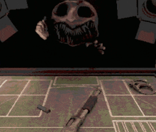

# Buckshot Roulette AI (Deep Q Learning)

This repo is a bot I designed that uses Deep Q learning to learn and play the video game [Buckshot Roulette](https://store.steampowered.com/app/1944510/Buckshot_Roulette/), developed by Mike Klubnika and published by Critical Reflex. 

**<span style="color:red;">Warning: This bot is incomplete and is prone to making incorrect decisions.</span>**

## What is Buckshot Roulette?

Buckshot Roulette consists of two players - a player, and a dealer - as well as a shotgun that can be loaded with both live and blank shells at random, though the players are shown the quantities of each shell in the clip. The player and the dealer take turns guessing whether the top shell is live or blank, and take turns shooting the shotgun until one of their HP hits zero, kind of like a multiplayer russian roulette. 

Though buckshot roulette seems simple at surface level, there are quite a few interesting game mechanics that make this game's play far deeper than one would initially suspect. For example, you have the option to shoot yourself and take an additional turn if it misses - risky, but rewarding if the top shell is a blank. There are also 9 different single-use items in the game that each have interesting and unique effects on the game state that both players are given to use in each round - a magnifying glass revealing the top shell (seen in gif below), a hacksaw that doubles the damage of the next round fired, an inverter that flips the state of the top shell, and so on. This makes for a game layered with interesting decisions for both players, and a great game for ML models to master.



## Training

The player has a substantial advantage by going first in each round, so I made the decision to train the player and the dealer bot separately (note - this is definitely not the most optimal way of doing it). 

### Deep Q Network (DQN) Architecture

The DQN I chose to use is a relatively standard one consisting of 3 fully connected layers, initialized with xavier uniform weights and relu activation functions:

```
class DQN(nn.Module):
    def __init__(self, input_dim, output_dim):
        super(DQN, self).__init__()
        self.fc1 = nn.Linear(input_dim, 128)
        self.fc2 = nn.Linear(128, 256)
        self.fc3 = nn.Linear(256, output_dim)

        nn.init.xavier_uniform_(self.fc1.weight)
        nn.init.xavier_uniform_(self.fc2.weight)
        nn.init.xavier_uniform_(self.fc3.weight)

    def forward(self, x):
        x = torch.relu(self.fc1(x))
        x = torch.relu(self.fc2(x))
        return self.fc3(x)
```

### Training Loop

During training, the player and dealer agents take turns and store the result of the game in their memory, and periodically update their target networks. Models are trained with E-Greedy, a policy that gradually lowers the chance of a random action instead of a chosen action to around 1-5% during the course of training (I have the bot set at 3%). The intention of this is for the bot to balance exploration and exploitation, and encourage it to find the 'best' solution instead of just a 'good' solution. 

Masking is also used to prevent the bot from selecting illegal actions, since the action space is constant. 

## Replays

The bot saves replays of each game to a .json file in the Replays folder. These can be manually reviewed with some difficulty, but it is not intuitive. I am currently working on a way to view these replays for debugging and analysis. 

## Future

I want to try training this for a million or so games and see how well it does. If anyone somehow sees this repo and has suggestions for how to improve it, please feel free to fork it and do as you wish, or feel free to contact me on discord: darkchax